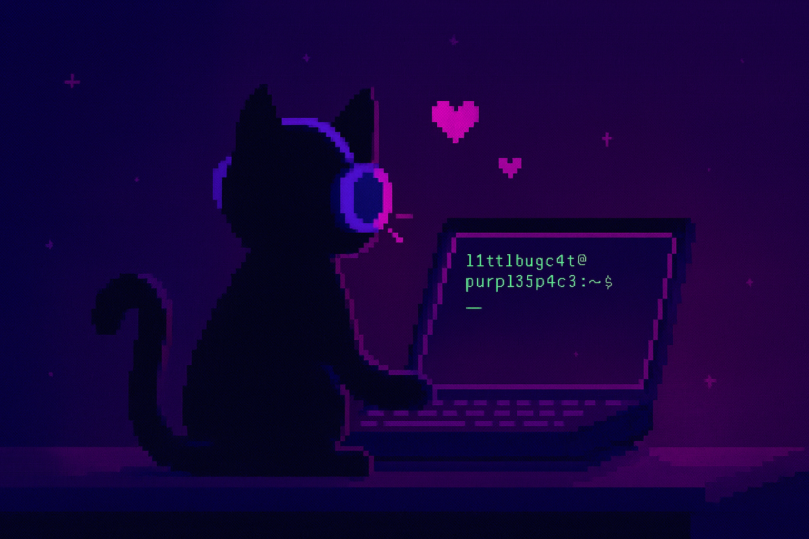

<p align="center">
  
</p>

# 💜 purpl35p4c3

> “We don’t just hack the planet. We purr on it first.” — l1ttl3bugc4t 🐾

Bienvenida al **espacio púrpura** de herramientas felinas para multiples propósitos.  
Este repositorio mezcla poder, sigilo y ternura.  
Porque incluso las garras más afiladas vienen con patitas suaves.

---

## 🔍 ¿Qué encontrarás aquí?

- 🐾 Scripts personalizados para diferentes propósitos
- 🐱 Herramientas con conciencia ética.
- ✨ Documentación que brilla y no abruma.
- 👩‍💻 Operaciones inspiradas por gatos sigilosos (y a veces ruidosos).

---

## ⚙️ Quickstart

```bash
git clone https://github.com/l1ttl3bugc4t/purpl35p4c3.git
cd purpl35p4c3/src
